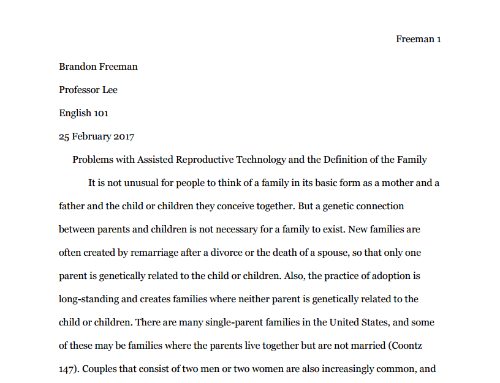
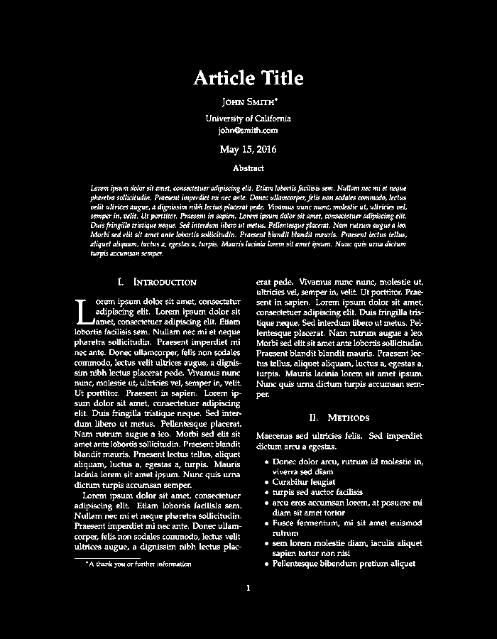
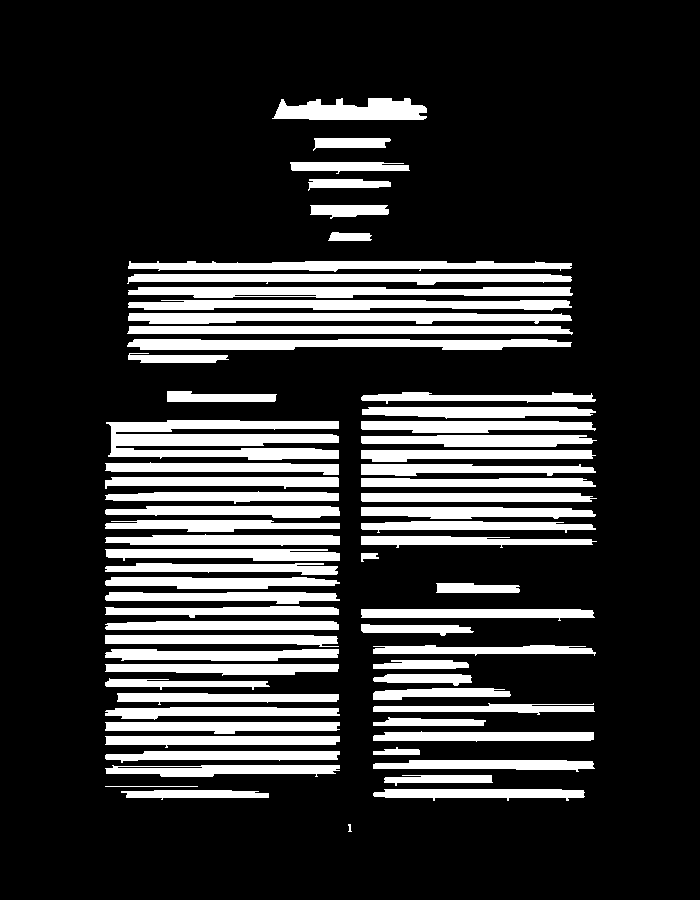

# rlsa_python
This is a python implementation of the Run Length Smoothing Algorithm (RLSA). It was designed with text document layout analysis in mind in order to merge charatcters on the same line and make it easier to identify senteces and paragraphs.

## External requirements
rlsa_python only requires you to have numpy installed.

## Usage
### How to install it
```sh
$ pip install rlsa_python
```
### How to use it
Let's say we are trying to apply rlsa to the following image:



You would first read in the image as a numpy array and convert it to inverse binary. It is also recommended, but not required, to apply filters like a gaussian or morphological filter to remove unwanted noise.
```python
# Use any image processing library you like, but the image passed to RLSA has to be a numpy array.
# In this case I am using opencv.
import cv2

# Read the image.
img = cv2.imread(image_file_path)

# Convert it to inverse binary.
gray_scale = cv2.cvtColor(img, cv2.COLOR_RGB2GRAY)
__, binary_image = cv2.threshold(gray_scale, 0, 255, cv2.THRESH_BINARY_INV | cv2.THRESH_OTSU)
```

The result should be something like this:


Then you can use the rlsa_python library like so:

```python
# Import RLSA class
from rlsa_python.rlsa import RLSA

smeared_text_image = RLSA.apply_rlsa(img, 100, 100, 50)
```
The result with the above image is the following:


